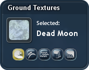
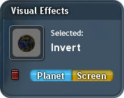

    

# A-xeseya & 0KepOnline's Share-Safe Adventure Textures & Effects

This mod unveils the advanced planet customization functionality, letting you select ground textures and a pair of custom visual effects. It does this by adding a new tab in the Sculpt palette of the Adventure Editor.

    

## Ground Textures

Ground textures are selected for one of five vanilla layers: **Detail**, **Detail Noise**, **Seabed**, **Cliff**, and **Beach**. Although any texture existing in the game files may be used as one, the mod provides a specific selection of textures that are considered the most useful for creating visually catchy planets.

Only the Detail & Cliff layers affect the visual appearance of a planet: this is not a bug, and the other three are kept for full compatibility with the original terrain scripts.

    

## Visual Effects

Visual effects are displayed both in the editor and on an adventure player’s screen. They can be either anchored to the screen (the way vanilla `adventureLook` cheat does that) or to the planet (this will replace the selected grass). Keep in mind that you can either select two visual effects or one visual effect and grass to distribute on a planet; you can’t combine both in the “Planet” tab.

You may select between vanilla adventure visual effects (Sepia, 8-/16-bit, Film Noir, Anguish, Watercolor), but also between different styles that are either used on the stages or are normally unused at all. Be careful with those, as there were cases of them not displaying for some players. Remember to test everything before you publish the adventure.

    

## Credits
 * **[A-xeseya](https://github.com/A-xesey)** & **[0KepOnline](https://github.com/0KepOnline)**	(experimenting with custom ground textures & visual effects in adventures and creating this mod)

 (additional translation credits can be found in `.locale` files [here](./data/Scenario_ShareSafe_TexturesEffects/root~/))

 **Special thanks to:**
 * **[emd4600](https://github.com/emd4600)**	(creating [SporeModder FX](https://github.com/Spore-Community/SporeModder-FX) and [Spore ModAPI](https://github.com/Spore-Community/Spore-ModAPI))
 * **[Psi](https://github.com/MADPSI)**	(beta testing & providing feedback)
 * **[VanillaCold](https://github.com/VanillaCold)**	(beta testing & providing feedback)
 * **[Liskomato](https://github.com/Liskomato)**	(beta testing & providing feedback)
